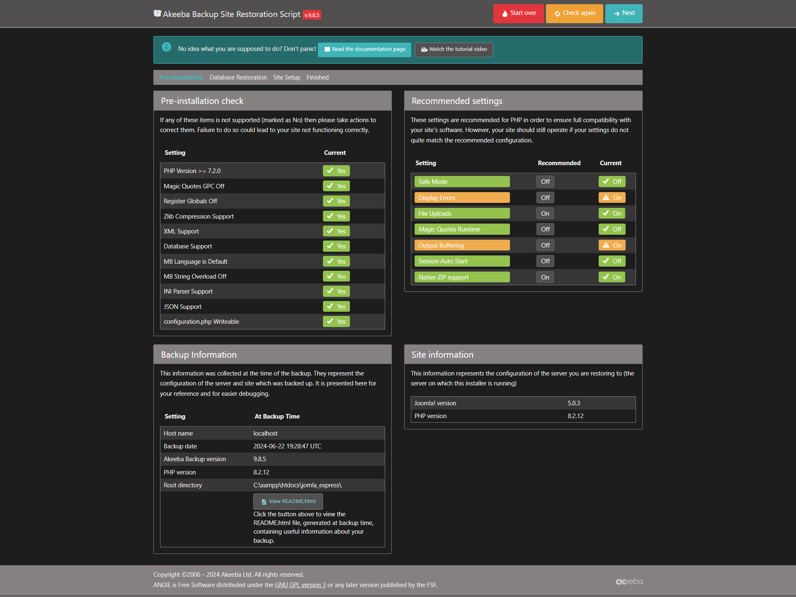
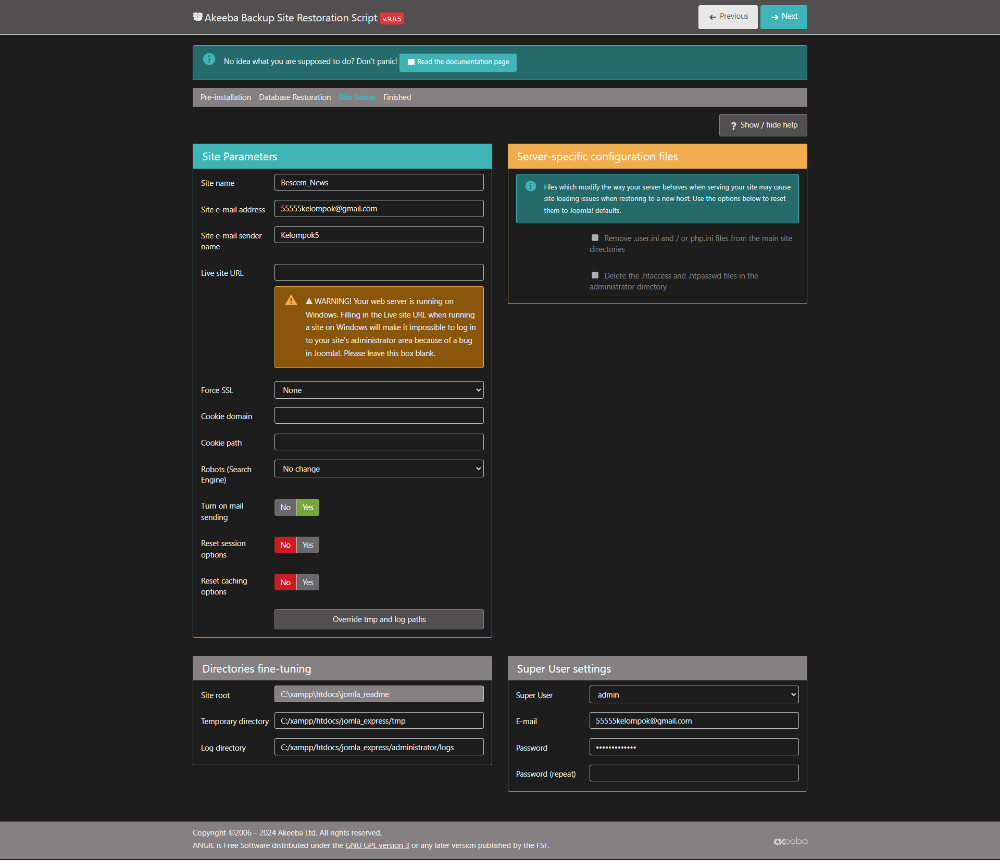
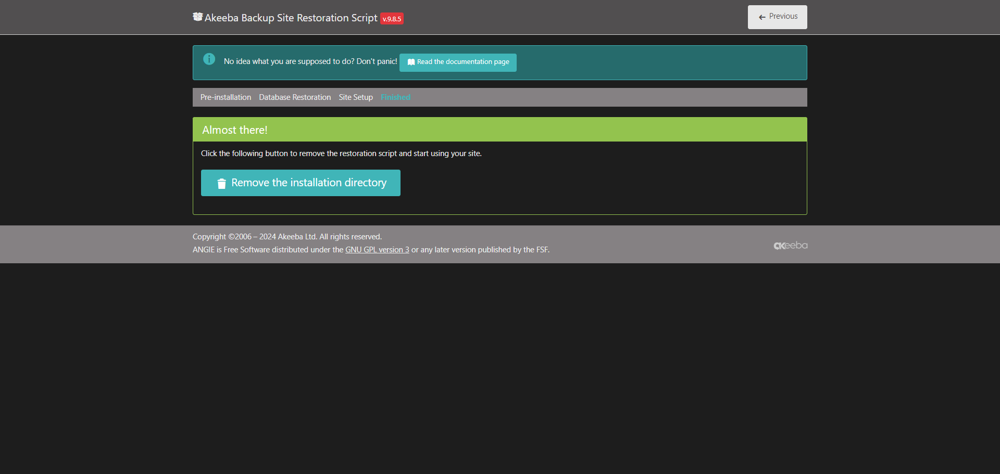

# Readme Aplikasi Joomla dengan XAMPP

Aplikasi ini adalah tutorial langkah-langkah untuk menjalankan aplikasi Joomla dengan XAMPP. Aplikasi ini dibuat untuk mempermudah pengguna agar mudah menjalankan aplikasi Joomla. Aplikasi ini juga dibuat untuk mempermudah pengguna yang baru memulai belajar mengenai Joomla dan XAMPP. Aplikasi ini juga dibuat untuk mempermudah pengguna yang ingin membuat aplikasi Joomla dengan mudah.

Berikut langkah-langkah menjalankan aplikasi:

1. Buka Aplikasi XAMPP
2. Buat Database dengan nama bebas apa saja
3. Import Database yang ada di folder
4. Buka File Joomla untuk Instalasi
5. Letakkan file Joomla di XAMPP > htdocs
6. Jalankan Instalasi

7. Klik Next

8. Isi kolom input dengan nama database yang sudah dibuat
9. Klik Next jika sudah mengisi input nya
10. Akan muncul kotak pop up jika berhasil, klik Next

11. Lakukan Setting User seperti di gambar jika sudah Next

12. Jika sudah selesai, hapus folder instalasi pada folder Joomla
13. Joomla siap di gunakan

